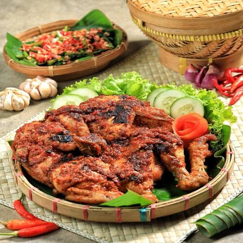

<!-- Phill Badge menu makanan -->

<!-- Tradisional (Amber / Brown) -->

    Tradisional

<!-- Nasi Kotak (Orange) -->

    Nasi Kotak

<!-- Snack Box (Indigo / Purple) -->

    Snack Box

<!-- Parcel (Rose / Pink) -->

    Parcel

<!-- Ayam (Red) -->

    Ayam

<!-- Lele (Cyan / Blue) -->

    Lele

<!-- Telur (Yellow) -->

    Telur

<!-- Aneka Macam (Slate / Gray) -->

    Aneka Macam

<!-- menu.html -->
<section id="full-menu" 
        class="hidden md:flex py-24 bg-slate-50 dark:bg-slate-950 transition-colors duration-500 min-h-screen" 
        x-data="{ kategoriAktif: 'all' }">

    

        
        

            <h2 class="text-4xl md:text-5xl font-black text-slate-950 dark:text-white mb-6">
                Pilih Menu 
                
                    Favoritmu
                
            </h2>

            

                <button @click="kategoriAktif = 'all'" 
                        :class="kategoriAktif === 'all' ? 'bg-green-600 text-white' : 'text-slate-500 hover:bg-slate-50 dark:hover:bg-slate-800'" 
                        class="px-6 py-2.5 rounded-2xl font-bold transition-all text-sm">
                        Semua
                </button>

                <button @click="kategoriAktif = 'best_seller'" 
                        :class="kategoriAktif === 'best_seller' ? 'bg-green-600 text-white' : 'text-slate-500 hover:bg-slate-50 dark:hover:bg-slate-800'" 
                        class="px-6 py-2.5 rounded-2xl font-bold transition-all text-sm">
                        Best Seller
                </button>

                <button @click="kategoriAktif = 'tradisional'" 
                        :class="kategoriAktif === 'tradisional' ? 'bg-green-600 text-white' : 'text-slate-500 hover:bg-slate-50 dark:hover:bg-slate-800'" 
                        class="px-6 py-2.5 rounded-2xl font-bold transition-all text-sm">
                        Tradisional
                </button>

                <button @click="kategoriAktif = 'nasi_kotak'" 
                        :class="kategoriAktif === 'nasi_kotak' ? 'bg-green-600 text-white' : 'text-slate-500 hover:bg-slate-50 dark:hover:bg-slate-800'" 
                        class="px-6 py-2.5 rounded-2xl font-bold transition-all text-sm">
                        Nasi Kotak
                </button>

                <button @click="kategoriAktif = 'snack_box'" 
                        :class="kategoriAktif === 'snack_box' ? 'bg-green-600 text-white' : 'text-slate-500 hover:bg-slate-50 dark:hover:bg-slate-800'" 
                        class="px-6 py-2.5 rounded-2xl font-bold transition-all text-sm">
                        Snack Box
                </button>

                <button @click="kategoriAktif = 'parcel'" 
                        :class="kategoriAktif === 'parcel' ? 'bg-green-600 text-white' : 'text-slate-500 hover:bg-slate-50 dark:hover:bg-slate-800'" 
                        class="px-6 py-2.5 rounded-2xl font-bold transition-all text-sm">
                        Parcel
                </button>

                <button @click="kategoriAktif = 'aneka_macam'" 
                        :class="kategoriAktif === 'aneka_macam' ? 'bg-green-600 text-white' : 'text-slate-500 hover:bg-slate-50 dark:hover:bg-slate-800'" 
                        class="px-6 py-2.5 rounded-2xl font-bold transition-all text-sm">
                        Aneka Macam
                </button>

            

        

        
 res.text())
                    .then(data => { 
                        isiMenu = data; 
                        $nextTick(() => initAOS()); 
                    })" 
            x-html="isiMenu">
        

    

</section>

<!-- isi-menu.html -->

    

        

            
            

                🔥
                Best Seller
            

        

        

            

                Tradisional
                Ayam
            

            <h3 class="font-black text-slate-950 dark:text-white text-xl mb-2 group-hover:text-amber-600 transition-colors">Ayam Lodho Signature</h3>
            
Ayam kampung pilihan dengan kuah santan kental rempah pedas otentik.

            

                
HargaRp 25k

                <button class="h-12 w-12 bg-green-600 hover:bg-green-500 text-white rounded-2xl flex items-center justify-center shadow-lg transition-all active:scale-90">
                    <svg xmlns="http://www.w3.org/2000/svg" fill="none" viewBox="0 0 24 24" stroke-width="2" stroke="currentColor" class="w-6 h-6"><path d="M2.25 3h1.386c.51 0 .955.343 1.087.835l.383 1.437M7.5 14.25a3 3 0 0 0-3 3h15.75m-12.75-3h11.218c1.121-2.3 2.1-4.684 2.924-7.138a60.114 60.114 0 0 0-16.536-1.84M7.5 14.25 5.106 5.272M6 20.25a.75.75 0 1 1-1.5 0 .75.75 0 0 1 1.5 0Zm12.75 0a.75.75 0 1 1-1.5 0 .75.75 0 0 1 1.5 0Z" /></svg>
                </button>
            

        

    

<!-- Cart,html -->
<section class="max-w-6xl mx-auto py-12 px-6" data-aos="fade-up">
    
    

        

            <button @click="$store.navigasi.pindah('home')" 
                    class="group flex items-center justify-center w-12 h-12 bg-white/60 dark:bg-slate-900/60 backdrop-blur-xl rounded-2xl border border-white/20 dark:border-slate-800/50 shadow-sm hover:shadow-xl hover:bg-green-600 transition-all duration-300">
                <svg class="w-6 h-6 text-slate-600 dark:text-slate-300 group-hover:text-white transition-colors" fill="none" stroke="currentColor" viewBox="0 0 24 24">
                    <path stroke-linecap="round" stroke-linejoin="round" stroke-width="2.5" d="M15 19l-7-7 7-7"/>
                </svg>
            </button>
            
            

                <h1 class="text-4xl font-black dark:text-white tracking-tight">
                    Keranjang 
                    
                        Pesanan
                    
                </h1>
                

                    Konfirmasi menu pilihanmu
                

            

        

        

            
                🍽️
            
            
        

    

    

    
        

            <template x-if="$store.keranjang.items.length === 0">
                

                    

                        🛒
                    

                    

                        Wah, keranjangmu masih kosong nih!
                    

                    <button @click="$store.navigasi.pindah('menu')" 
                            class="group relative mt-8 px-8 py-4 font-black rounded-2xl transition-all duration-300 active:scale-95 overflow-hidden
                                bg-white text-green-600 border border-slate-100
                                hover:bg-green-600 hover:text-white
                                dark:bg-slate-800 dark:text-green-400 dark:border-slate-700 dark:shadow-none
                                dark:hover:bg-green-800 dark:hover:text-white dark:hover:border-green-700">
                        
                        

                            Cari Makanan Enak
                        

                    </button>
                

            </template>

            <template x-for="(item, index) in $store.keranjang.items" :key="index">
                

                    
                    

                        <h4 class="text-lg font-black dark:text-white font-sans" x-text="item.name"></h4>
                        

                            Rp 0
                        

                        
                        

                            

                                <button @click="$store.keranjang.updateQty(index, -1)" class="w-9 h-9 flex items-center justify-center hover:bg-white dark:hover:bg-slate-700 rounded-lg transition-all font-bold dark:text-white">
                                    -
                                </button>
                                
                                <button @click="$store.keranjang.updateQty(index, 1)" class="w-9 h-9 flex items-center justify-center hover:bg-white dark:hover:bg-slate-700 rounded-lg transition-all font-bold dark:text-white">
                                    +
                                </button>
                            

                            <button @click="$store.keranjang.hapus(index)" class="text-sm text-red-500 font-bold hover:bg-red-50 dark:hover:bg-red-900/20 px-3 py-1.5 rounded-xl transition-all">
                                Hapus
                            </button>
                        

                    

                

            </template>
        

        

            

                <h2 class="font-black mb-4 dark:text-white uppercase text-[11px] tracking-[0.2em] italic text-slate-400">
                    Ringkasan Pesanan
                </h2>
                
                

                    

                        
                            Subtotal
                        
                        
                            Rp 0
                        
                    

                    

                        
                            Biaya Layanan
                        
                         0 ? 'Rp ' + $store.keranjang.biayaLayanan.toLocaleString() : 'Rp 0'">
                            Rp 2,500
                        
                    

                    
                    

                    
                    

                        
                            Total Bayar
                        
                        
                            Rp 0
                        
                    

                    <button class="w-full py-5 bg-green-600 text-white text-lg font-black rounded-2xl shadow-[0_20px_40px_-10px_rgba(22,163,74,0.3)] hover:bg-green-700 transition-all active:scale-95 flex items-center justify-center gap-3">
                        Lanjut Pembayaran
                        <svg class="w-5 h-5" fill="none" stroke="currentColor" viewBox="0 0 24 24"><path stroke-linecap="round" stroke-linejoin="round" stroke-width="3" d="M14 5l7 7m0 0l-7 7m7-7H3"/></svg>
                    </button>
                

            

        

    

</section>

<!-- cart.js -->
document.addEventListener('alpine:init', () => {
    Alpine.store('keranjang', {
        items: JSON.parse(localStorage.getItem('cart_items')) || [],
        biayaLayanan: 2500,
        isOpen: false,
        showToast: false,
        toastMsg: '',

        // Simpan data ke Local Storage
        simpanKeLokal() {
            localStorage.setItem('cart_items', JSON.stringify(this.items));
        },
        
        // Fungsi Tambah Item
        tambah(name, price, image) {
            let found = this.items.find(i => i.name === name);
            if (found) {
                found.qty++;
            } else {
                this.items.push({ name, price, image, qty: 1 });
            }

            this.simpanKeLokal();

            // Logika Notifikasi
            this.toastMsg = 'Makanan berhasil ditambahkan ke keranjang';
            this.showToast = true;

            // Notifikasi akan hilang setelah 3 detik
            setTimeout(() => {
                this.showToast = false;
            }, 3000);
        },
        
        // Fungsi Update Quantity
        updateQty(index, val) {
            this.items[index].qty += val;
            if (this.items[index].qty < 1) {
                this.hapus(index);
            } else {
                this.simpanKeLokal();
            }
        },

        // Fungsi Hapus Item
        hapus(index) {
            this.items.splice(index, 1);

            this.simpanKeLokal();
        },
        
        // Kalkulasi Total Harga
        get totalHarga() {
            const total = this.items.reduce((sum, item) => sum + (Number(item.price) * Number(item.qty)), 0);
            return total;
        },

        get totalBayar() {
            if (this.items.length === 0) return 0;
            return this.totalHarga + this.biayaLayanan;
        },
        
        // Kalkulasi Total Item untuk Badge di Navbar
        get totalItem() {
            return this.items.reduce((total, item) => total + item.qty, 0);
        }
    });
});

// Logika Daftar Menu Makanan
// document.addEventListener('alpine:init', () => {
//     Alpine.data('menuResto', () => ({
//         foods: [
//             {
//                 id: 1,
//                 name: 'Matcha Latte Latte',
//                 price: 25000,
//                 image: 'img/matcha.jpg',
//                 category: 'minuman'
//             },
//             {
//                 id: 2,
//                 name: 'Beef Teriyaki Bento',
//                 price: 45000,
//                 image: 'img/bento.jpg',
//                 category: 'makanan'
//             },
//             {
//                 id: 3,
//                 name: 'Salmon Sushi',
//                 price: 35000,
//                 image: 'img/sushi.jpg',
//                 category: 'makanan'
//             }
//         ]
//     }));
// });

isi-menu.html
<!-- Contoh Isi Menu || Desktop -->
<!-- 

    

        

            

            

                
                    🔥
                
                
                    Best Seller
                
            

        

        

            

                
                    Tradisional
                
                
                    Parcel
                
            

            <h3 class="font-black text-slate-950 dark:text-white text-xl mb-2">
                Ayam Lodho Signature
            </h3>

            

                Ayam kampung pilihan dengan kuah santan kental rempah pedas otentik.
            

            

                

                    
                        Harga
                    

                    
                        Rp 25k
                    
                

                <button class="tombol-tambah h-12 w-12 bg-green-600 hover:bg-green-500 text-white rounded-2xl flex items-center justify-center shadow-lg transition-all duration-300 group-hover:ring-4 group-hover:ring-green-500/30 active:scale-90"
                        data-name="Ayam Lodho Signature" 
                        data-price="25000"
                        data-image="Storage/img/menu-makanan/ayam-lodho.jpeg">

                    <svg xmlns="http://www.w3.org/2000/svg" fill="none" viewBox="0 0 24 24" stroke-width="2" stroke="currentColor" 
                        class="w-6 h-6 transition-transform duration-300 group-hover:scale-125">
                        <path d="M2.25 3h1.386c.51 0 .955.343 1.087.835l.383 1.437M7.5 14.25a3 3 0 0 0-3 3h15.75m-12.75-3h11.218c1.121-2.3 2.1-4.684 2.924-7.138a60.114 60.114 0 0 0-16.536-1.84M7.5 14.25 5.106 5.272M6 20.25a.75.75 0 1 1-1.5 0 .75.75 0 0 1 1.5 0Zm12.75 0a.75.75 0 1 1-1.5 0 .75.75 0 0 1 1.5 0Z" />
                    </svg>
                </button>

            

        

    

    

        

            

            

                
                    🔥
                
                
                    Best Seller
                
            

        

        

            

                
                    Tradisional
                
                
                    Parcel
                
            

            <h3 class="font-black text-slate-950 dark:text-white text-xl mb-2">
                Ayam Lodho Signature
            </h3>

            

                Ayam kampung pilihan dengan kuah santan kental rempah pedas otentik.
            

            

                

                    
                        Harga
                    

                    
                        Rp 25k
                    
                

                <button class="tombol-tambah h-12 w-12 bg-green-600 hover:bg-green-500 text-white rounded-2xl flex items-center justify-center shadow-lg transition-all duration-300 group-hover:ring-4 group-hover:ring-green-500/30 active:scale-90"
                        data-name="Ayam Lodho Signature" 
                        data-price="25000"
                        data-image="Storage/img/menu-makanan/ayam-lodho.jpeg">

                    <svg xmlns="http://www.w3.org/2000/svg" fill="none" viewBox="0 0 24 24" stroke-width="2" stroke="currentColor" 
                        class="w-6 h-6 transition-transform duration-300 group-hover:scale-125">
                        <path d="M2.25 3h1.386c.51 0 .955.343 1.087.835l.383 1.437M7.5 14.25a3 3 0 0 0-3 3h15.75m-12.75-3h11.218c1.121-2.3 2.1-4.684 2.924-7.138a60.114 60.114 0 0 0-16.536-1.84M7.5 14.25 5.106 5.272M6 20.25a.75.75 0 1 1-1.5 0 .75.75 0 0 1 1.5 0Zm12.75 0a.75.75 0 1 1-1.5 0 .75.75 0 0 1 1.5 0Z" />
                    </svg>
                </button>

            

        

    

    

        

            

            

                
                    🔥
                
                
                    Best Seller
                
            

        

        

            

                
                    Tradisional
                
                
                    Parcel
                
            

            <h3 class="font-black text-slate-950 dark:text-white text-xl mb-2">
                Ayam Lodho Signature
            </h3>

            

                Ayam kampung pilihan dengan kuah santan kental rempah pedas otentik.
            

            

                

                    
                        Harga
                    

                    
                        Rp 25k
                    
                

                <button class="tombol-tambah h-12 w-12 bg-green-600 hover:bg-green-500 text-white rounded-2xl flex items-center justify-center shadow-lg transition-all duration-300 group-hover:ring-4 group-hover:ring-green-500/30 active:scale-90"
                        data-name="Ayam Lodho Signature" 
                        data-price="25000"
                        data-image="Storage/img/menu-makanan/ayam-lodho.jpeg">

                    <svg xmlns="http://www.w3.org/2000/svg" fill="none" viewBox="0 0 24 24" stroke-width="2" stroke="currentColor" 
                        class="w-6 h-6 transition-transform duration-300 group-hover:scale-125">
                        <path d="M2.25 3h1.386c.51 0 .955.343 1.087.835l.383 1.437M7.5 14.25a3 3 0 0 0-3 3h15.75m-12.75-3h11.218c1.121-2.3 2.1-4.684 2.924-7.138a60.114 60.114 0 0 0-16.536-1.84M7.5 14.25 5.106 5.272M6 20.25a.75.75 0 1 1-1.5 0 .75.75 0 0 1 1.5 0Zm12.75 0a.75.75 0 1 1-1.5 0 .75.75 0 0 1 1.5 0Z" />
                    </svg>
                </button>

            

        

    

    

        

            

            

                
                    🔥
                
                
                    Best Seller
                
            

        

        

            

                
                    Tradisional
                
                
                    Parcel
                
            

            <h3 class="font-black text-slate-950 dark:text-white text-xl mb-2">
                Ayam Lodho Signature
            </h3>

            

                Ayam kampung pilihan dengan kuah santan kental rempah pedas otentik.
            

            

                

                    
                        Harga
                    

                    
                        Rp 25k
                    
                

                <button class="tombol-tambah h-12 w-12 bg-green-600 hover:bg-green-500 text-white rounded-2xl flex items-center justify-center shadow-lg transition-all duration-300 group-hover:ring-4 group-hover:ring-green-500/30 active:scale-90"
                        data-name="Ayam Lodho Signature" 
                        data-price="25000"
                        data-image="Storage/img/menu-makanan/ayam-lodho.jpeg">

                    <svg xmlns="http://www.w3.org/2000/svg" fill="none" viewBox="0 0 24 24" stroke-width="2" stroke="currentColor" 
                        class="w-6 h-6 transition-transform duration-300 group-hover:scale-125">
                        <path d="M2.25 3h1.386c.51 0 .955.343 1.087.835l.383 1.437M7.5 14.25a3 3 0 0 0-3 3h15.75m-12.75-3h11.218c1.121-2.3 2.1-4.684 2.924-7.138a60.114 60.114 0 0 0-16.536-1.84M7.5 14.25 5.106 5.272M6 20.25a.75.75 0 1 1-1.5 0 .75.75 0 0 1 1.5 0Zm12.75 0a.75.75 0 1 1-1.5 0 .75.75 0 0 1 1.5 0Z" />
                    </svg>
                </button>

            

        

    

    

        

            

            

                
                    🔥
                
                
                    Best Seller
                
            

        

        

            

                
                    Tradisional
                
                
                    Parcel
                
            

            <h3 class="font-black text-slate-950 dark:text-white text-xl mb-2">
                Ayam Lodho Signature
            </h3>

            

                Ayam kampung pilihan dengan kuah santan kental rempah pedas otentik.
            

            

                

                    
                        Harga
                    

                    
                        Rp 25k
                    
                

                <button class="tombol-tambah h-12 w-12 bg-green-600 hover:bg-green-500 text-white rounded-2xl flex items-center justify-center shadow-lg transition-all duration-300 group-hover:ring-4 group-hover:ring-green-500/30 active:scale-90"
                        data-name="Ayam Lodho Signature" 
                        data-price="25000"
                        data-image="Storage/img/menu-makanan/ayam-lodho.jpeg">

                    <svg xmlns="http://www.w3.org/2000/svg" fill="none" viewBox="0 0 24 24" stroke-width="2" stroke="currentColor" 
                        class="w-6 h-6 transition-transform duration-300 group-hover:scale-125">
                        <path d="M2.25 3h1.386c.51 0 .955.343 1.087.835l.383 1.437M7.5 14.25a3 3 0 0 0-3 3h15.75m-12.75-3h11.218c1.121-2.3 2.1-4.684 2.924-7.138a60.114 60.114 0 0 0-16.536-1.84M7.5 14.25 5.106 5.272M6 20.25a.75.75 0 1 1-1.5 0 .75.75 0 0 1 1.5 0Zm12.75 0a.75.75 0 1 1-1.5 0 .75.75 0 0 1 1.5 0Z" />
                    </svg>
                </button>

            

        

    

    

        

            

            

                
                    🔥
                
                
                    Best Seller
                
            

        

        

            

                
                    Tradisional
                
                
                    Parcel
                
            

            <h3 class="font-black text-slate-950 dark:text-white text-xl mb-2">
                Ayam Lodho Signature
            </h3>

            

                Ayam kampung pilihan dengan kuah santan kental rempah pedas otentik.
            

            

                

                    
                        Harga
                    

                    
                        Rp 25k
                    
                

                <button class="tombol-tambah h-12 w-12 bg-green-600 hover:bg-green-500 text-white rounded-2xl flex items-center justify-center shadow-lg transition-all duration-300 group-hover:ring-4 group-hover:ring-green-500/30 active:scale-90"
                        data-name="Ayam Lodho Signature" 
                        data-price="25000"
                        data-image="Storage/img/menu-makanan/ayam-lodho.jpeg">

                    <svg xmlns="http://www.w3.org/2000/svg" fill="none" viewBox="0 0 24 24" stroke-width="2" stroke="currentColor" 
                        class="w-6 h-6 transition-transform duration-300 group-hover:scale-125">
                        <path d="M2.25 3h1.386c.51 0 .955.343 1.087.835l.383 1.437M7.5 14.25a3 3 0 0 0-3 3h15.75m-12.75-3h11.218c1.121-2.3 2.1-4.684 2.924-7.138a60.114 60.114 0 0 0-16.536-1.84M7.5 14.25 5.106 5.272M6 20.25a.75.75 0 1 1-1.5 0 .75.75 0 0 1 1.5 0Zm12.75 0a.75.75 0 1 1-1.5 0 .75.75 0 0 1 1.5 0Z" />
                    </svg>
                </button>

            

        

    

    

        

            

            

                
                    🔥
                
                
                    Best Seller
                
            

        

        

            

                
                    Tradisional
                
                
                    Parcel
                
            

            <h3 class="font-black text-slate-950 dark:text-white text-xl mb-2">
                Ayam Lodho Signature
            </h3>

            

                Ayam kampung pilihan dengan kuah santan kental rempah pedas otentik.
            

            

                

                    
                        Harga
                    

                    
                        Rp 25k
                    
                

                <button class="tombol-tambah h-12 w-12 bg-green-600 hover:bg-green-500 text-white rounded-2xl flex items-center justify-center shadow-lg transition-all duration-300 group-hover:ring-4 group-hover:ring-green-500/30 active:scale-90"
                        data-name="Ayam Lodho Signature" 
                        data-price="25000"
                        data-image="Storage/img/menu-makanan/ayam-lodho.jpeg">

                    <svg xmlns="http://www.w3.org/2000/svg" fill="none" viewBox="0 0 24 24" stroke-width="2" stroke="currentColor" 
                        class="w-6 h-6 transition-transform duration-300 group-hover:scale-125">
                        <path d="M2.25 3h1.386c.51 0 .955.343 1.087.835l.383 1.437M7.5 14.25a3 3 0 0 0-3 3h15.75m-12.75-3h11.218c1.121-2.3 2.1-4.684 2.924-7.138a60.114 60.114 0 0 0-16.536-1.84M7.5 14.25 5.106 5.272M6 20.25a.75.75 0 1 1-1.5 0 .75.75 0 0 1 1.5 0Zm12.75 0a.75.75 0 1 1-1.5 0 .75.75 0 0 1 1.5 0Z" />
                    </svg>
                </button>

            

        

    

    

        

            

            

                
                    🔥
                
                
                    Best Seller
                
            

        

        

            

                
                    Tradisional
                
                
                    Parcel
                
            

            <h3 class="font-black text-slate-950 dark:text-white text-xl mb-2">
                Ayam Lodho Signature
            </h3>

            

                Ayam kampung pilihan dengan kuah santan kental rempah pedas otentik.
            

            

                

                    
                        Harga
                    

                    
                        Rp 25k
                    
                

                <button class="tombol-tambah h-12 w-12 bg-green-600 hover:bg-green-500 text-white rounded-2xl flex items-center justify-center shadow-lg transition-all duration-300 group-hover:ring-4 group-hover:ring-green-500/30 active:scale-90"
                        data-name="Ayam Lodho Signature" 
                        data-price="25000"
                        data-image="Storage/img/menu-makanan/ayam-lodho.jpeg">

                    <svg xmlns="http://www.w3.org/2000/svg" fill="none" viewBox="0 0 24 24" stroke-width="2" stroke="currentColor" 
                        class="w-6 h-6 transition-transform duration-300 group-hover:scale-125">
                        <path d="M2.25 3h1.386c.51 0 .955.343 1.087.835l.383 1.437M7.5 14.25a3 3 0 0 0-3 3h15.75m-12.75-3h11.218c1.121-2.3 2.1-4.684 2.924-7.138a60.114 60.114 0 0 0-16.536-1.84M7.5 14.25 5.106 5.272M6 20.25a.75.75 0 1 1-1.5 0 .75.75 0 0 1 1.5 0Zm12.75 0a.75.75 0 1 1-1.5 0 .75.75 0 0 1 1.5 0Z" />
                    </svg>
                </button>

            

        

    

    

        

            

            

                
                    🔥
                
                
                    Best Seller
                
            

        

        

            

                
                    Tradisional
                
                
                    Parcel
                
            

            <h3 class="font-black text-slate-950 dark:text-white text-xl mb-2">
                Ayam Lodho Signature
            </h3>

            

                Ayam kampung pilihan dengan kuah santan kental rempah pedas otentik.
            

            

                

                    
                        Harga
                    

                    
                        Rp 25k
                    
                

                <button class="tombol-tambah h-12 w-12 bg-green-600 hover:bg-green-500 text-white rounded-2xl flex items-center justify-center shadow-lg transition-all duration-300 group-hover:ring-4 group-hover:ring-green-500/30 active:scale-90"
                        data-name="Ayam Lodho Signature" 
                        data-price="25000"
                        data-image="Storage/img/menu-makanan/ayam-lodho.jpeg">

                    <svg xmlns="http://www.w3.org/2000/svg" fill="none" viewBox="0 0 24 24" stroke-width="2" stroke="currentColor" 
                        class="w-6 h-6 transition-transform duration-300 group-hover:scale-125">
                        <path d="M2.25 3h1.386c.51 0 .955.343 1.087.835l.383 1.437M7.5 14.25a3 3 0 0 0-3 3h15.75m-12.75-3h11.218c1.121-2.3 2.1-4.684 2.924-7.138a60.114 60.114 0 0 0-16.536-1.84M7.5 14.25 5.106 5.272M6 20.25a.75.75 0 1 1-1.5 0 .75.75 0 0 1 1.5 0Zm12.75 0a.75.75 0 1 1-1.5 0 .75.75 0 0 1 1.5 0Z" />
                    </svg>
                </button>

            

        

    

    

        

            

            

                
                    🔥
                
                
                    Best Seller
                
            

        

        

            

                
                    Tradisional
                
                
                    Parcel
                
            

            <h3 class="font-black text-slate-950 dark:text-white text-xl mb-2">
                Ayam Lodho Signature
            </h3>

            

                Ayam kampung pilihan dengan kuah santan kental rempah pedas otentik.
            

            

                

                    
                        Harga
                    

                    
                        Rp 25k
                    
                

                <button class="tombol-tambah h-12 w-12 bg-green-600 hover:bg-green-500 text-white rounded-2xl flex items-center justify-center shadow-lg transition-all duration-300 group-hover:ring-4 group-hover:ring-green-500/30 active:scale-90"
                        data-name="Ayam Lodho Signature" 
                        data-price="25000"
                        data-image="Storage/img/menu-makanan/ayam-lodho.jpeg">

                    <svg xmlns="http://www.w3.org/2000/svg" fill="none" viewBox="0 0 24 24" stroke-width="2" stroke="currentColor" 
                        class="w-6 h-6 transition-transform duration-300 group-hover:scale-125">
                        <path d="M2.25 3h1.386c.51 0 .955.343 1.087.835l.383 1.437M7.5 14.25a3 3 0 0 0-3 3h15.75m-12.75-3h11.218c1.121-2.3 2.1-4.684 2.924-7.138a60.114 60.114 0 0 0-16.536-1.84M7.5 14.25 5.106 5.272M6 20.25a.75.75 0 1 1-1.5 0 .75.75 0 0 1 1.5 0Zm12.75 0a.75.75 0 1 1-1.5 0 .75.75 0 0 1 1.5 0Z" />
                    </svg>
                </button>

            

        

    

    

        

            

            

                
                    🔥
                
                
                    Best Seller
                
            

        

        

            

                
                    Tradisional
                
                
                    Parcel
                
            

            <h3 class="font-black text-slate-950 dark:text-white text-xl mb-2">
                Ayam Lodho Signature
            </h3>

            

                Ayam kampung pilihan dengan kuah santan kental rempah pedas otentik.
            

            

                

                    
                        Harga
                    

                    
                        Rp 25k
                    
                

                <button class="tombol-tambah h-12 w-12 bg-green-600 hover:bg-green-500 text-white rounded-2xl flex items-center justify-center shadow-lg transition-all duration-300 group-hover:ring-4 group-hover:ring-green-500/30 active:scale-90"
                        data-name="Ayam Lodho Signature" 
                        data-price="25000"
                        data-image="Storage/img/menu-makanan/ayam-lodho.jpeg">

                    <svg xmlns="http://www.w3.org/2000/svg" fill="none" viewBox="0 0 24 24" stroke-width="2" stroke="currentColor" 
                        class="w-6 h-6 transition-transform duration-300 group-hover:scale-125">
                        <path d="M2.25 3h1.386c.51 0 .955.343 1.087.835l.383 1.437M7.5 14.25a3 3 0 0 0-3 3h15.75m-12.75-3h11.218c1.121-2.3 2.1-4.684 2.924-7.138a60.114 60.114 0 0 0-16.536-1.84M7.5 14.25 5.106 5.272M6 20.25a.75.75 0 1 1-1.5 0 .75.75 0 0 1 1.5 0Zm12.75 0a.75.75 0 1 1-1.5 0 .75.75 0 0 1 1.5 0Z" />
                    </svg>
                </button>

            

        

    

    

        

            

            

                
                    🔥
                
                
                    Best Seller
                
            

        

        

            

                
                    Tradisional
                
                
                    Parcel
                
            

            <h3 class="font-black text-slate-950 dark:text-white text-xl mb-2">
                Ayam Lodho Signature
            </h3>

            

                Ayam kampung pilihan dengan kuah santan kental rempah pedas otentik.
            

            

                

                    
                        Harga
                    

                    
                        Rp 25k
                    
                

                <button class="tombol-tambah h-12 w-12 bg-green-600 hover:bg-green-500 text-white rounded-2xl flex items-center justify-center shadow-lg transition-all duration-300 group-hover:ring-4 group-hover:ring-green-500/30 active:scale-90"
                        data-name="Ayam Lodho Signature" 
                        data-price="25000"
                        data-image="Storage/img/menu-makanan/ayam-lodho.jpeg">

                    <svg xmlns="http://www.w3.org/2000/svg" fill="none" viewBox="0 0 24 24" stroke-width="2" stroke="currentColor" 
                        class="w-6 h-6 transition-transform duration-300 group-hover:scale-125">
                        <path d="M2.25 3h1.386c.51 0 .955.343 1.087.835l.383 1.437M7.5 14.25a3 3 0 0 0-3 3h15.75m-12.75-3h11.218c1.121-2.3 2.1-4.684 2.924-7.138a60.114 60.114 0 0 0-16.536-1.84M7.5 14.25 5.106 5.272M6 20.25a.75.75 0 1 1-1.5 0 .75.75 0 0 1 1.5 0Zm12.75 0a.75.75 0 1 1-1.5 0 .75.75 0 0 1 1.5 0Z" />
                    </svg>
                </button>

            

        

    

 -->
<!-- End Contoh Item || Desktop -->

<!-- Contoh Isi Menu || Mobile -->
<!-- 

    
    

        
        

            

            

                <a class="text-[7px]">
                    🔥
                </a>
                <a class="text-orange-700 italic dark:text-orange-300">
                    Best Seller
                </a>
            

        

        

            

                

                    <a class="text-[7px] font-bold uppercase text-amber-600 bg-amber-50 px-1.5 py-0.5 rounded-md">
                        Tradisional
                    </a>
                

                
                <h3 class="font-black text-slate-900 dark:text-white text-sm line-clamp-1">
                    Ayam Lodho Signature
                </h3>
                
                

                    Ayam kampung kuah santan kental...
                

            

            

                

                    <a class="text-[14px] font-black text-green-600">
                        Rp 25.000
                    </a>
                

                

                    <button class="tombol-show h-7 w-7 bg-slate-100 dark:bg-slate-800 text-slate-500 hover:text-green-600 rounded-xl flex items-center justify-center transition-all duration-300 active:scale-90 border border-slate-200/50 dark:border-slate-700/50"
                            data-name="Ayam Lodho Signature" 
                            data-price="25000"
                            data-image="Storage/img/menu-makanan/ayam-lodho.jpeg"
                            data-desc="Ayam kampung pilihan dengan kuah santan kental rempah pedas otentik khas Tulungagung yang dimasak perlahan hingga meresap sempurna.">
                        
                        <svg xmlns="http://www.w3.org/2000/svg" fill="none" viewBox="0 0 24 24" stroke-width="2" stroke="currentColor" class="w-4 h-4">
                            <path stroke-linecap="round" stroke-linejoin="round" d="M2.036 12.322a1.012 1.012 0 0 1 0-.639C3.423 7.51 7.36 4.5 12 4.5c4.638 0 8.573 3.007 9.963 7.178.07.207.07.431 0 .639C20.577 16.49 16.64 19.5 12 19.5c-4.638 0-8.573-3.007-9.963-7.178Z" />
                            <path stroke-linecap="round" stroke-linejoin="round" d="M15 12a3 3 0 1 1-6 0 3 3 0 0 1 6 0Z" />
                        </svg>
                    </button>

                    <button class="tombol-tambah h-7 w-7 bg-green-600 hover:bg-green-500 text-white rounded-xl flex items-center justify-center shadow-lg transition-all duration-300 active:scale-90"
                            data-name="Ayam Lodho Signature" 
                            data-price="25000"
                            data-image="Storage/img/menu-makanan/ayam-lodho.jpeg">
                        
                        <svg xmlns="http://www.w3.org/2000/svg" fill="none" viewBox="0 0 24 24" stroke-width="2" stroke="currentColor" 
                            class="w-4 h-4 transition-transform duration-300 group-hover:scale-110">
                            <path d="M2.25 3h1.386c.51 0 .955.343 1.087.835l.383 1.437M7.5 14.25a3 3 0 0 0-3 3h15.75m-12.75-3h11.218c1.121-2.3 2.1-4.684 2.924-7.138a60.114 60.114 0 0 0-16.536-1.84M7.5 14.25 5.106 5.272M6 20.25a.75.75 0 1 1-1.5 0 .75.75 0 0 1 1.5 0Zm12.75 0a.75.75 0 1 1-1.5 0 .75.75 0 0 1 1.5 0Z" />
                        </svg>
                    </button>
                

            

        

    

    
    

        
        

            

            

                <a class="text-[7px]">
                    🔥
                </a>
                <a class="text-orange-700 italic dark:text-orange-300">
                    Best Seller
                </a>
            

        

        

            

                

                    <a class="text-[7px] font-bold uppercase text-amber-600 bg-amber-50 px-1.5 py-0.5 rounded-md">
                        Tradisional
                    </a>
                

                
                <h3 class="font-black text-slate-900 dark:text-white text-sm line-clamp-1">
                    Ayam Lodho Signature
                </h3>
                
                

                    Ayam kampung kuah santan kental...
                

            

            

                

                    <a class="text-[14px] font-black text-green-600">
                        Rp 25.000
                    </a>
                

                

                    <button class="tombol-show h-7 w-7 bg-slate-100 dark:bg-slate-800 text-slate-500 hover:text-green-600 rounded-xl flex items-center justify-center transition-all duration-300 active:scale-90 border border-slate-200/50 dark:border-slate-700/50"
                            data-name="Ayam Lodho Signature" 
                            data-price="25000"
                            data-image="Storage/img/menu-makanan/ayam-lodho.jpeg"
                            data-desc="Ayam kampung pilihan dengan kuah santan kental rempah pedas otentik khas Tulungagung yang dimasak perlahan hingga meresap sempurna.">
                        
                        <svg xmlns="http://www.w3.org/2000/svg" fill="none" viewBox="0 0 24 24" stroke-width="2" stroke="currentColor" class="w-4 h-4">
                            <path stroke-linecap="round" stroke-linejoin="round" d="M2.036 12.322a1.012 1.012 0 0 1 0-.639C3.423 7.51 7.36 4.5 12 4.5c4.638 0 8.573 3.007 9.963 7.178.07.207.07.431 0 .639C20.577 16.49 16.64 19.5 12 19.5c-4.638 0-8.573-3.007-9.963-7.178Z" />
                            <path stroke-linecap="round" stroke-linejoin="round" d="M15 12a3 3 0 1 1-6 0 3 3 0 0 1 6 0Z" />
                        </svg>
                    </button>

                    <button class="tombol-tambah h-7 w-7 bg-green-600 hover:bg-green-500 text-white rounded-xl flex items-center justify-center shadow-lg transition-all duration-300 active:scale-90"
                            data-name="Ayam Lodho Signature" 
                            data-price="25000"
                            data-image="Storage/img/menu-makanan/ayam-lodho.jpeg">
                        
                        <svg xmlns="http://www.w3.org/2000/svg" fill="none" viewBox="0 0 24 24" stroke-width="2" stroke="currentColor" 
                            class="w-4 h-4 transition-transform duration-300 group-hover:scale-110">
                            <path d="M2.25 3h1.386c.51 0 .955.343 1.087.835l.383 1.437M7.5 14.25a3 3 0 0 0-3 3h15.75m-12.75-3h11.218c1.121-2.3 2.1-4.684 2.924-7.138a60.114 60.114 0 0 0-16.536-1.84M7.5 14.25 5.106 5.272M6 20.25a.75.75 0 1 1-1.5 0 .75.75 0 0 1 1.5 0Zm12.75 0a.75.75 0 1 1-1.5 0 .75.75 0 0 1 1.5 0Z" />
                        </svg>
                    </button>
                

            

        

    

    
    

        
        

            

            

                <a class="text-[7px]">
                    🔥
                </a>
                <a class="text-orange-700 italic dark:text-orange-300">
                    Best Seller
                </a>
            

        

        

            

                

                    <a class="text-[7px] font-bold uppercase text-amber-600 bg-amber-50 px-1.5 py-0.5 rounded-md">
                        Tradisional
                    </a>
                

                
                <h3 class="font-black text-slate-900 dark:text-white text-sm line-clamp-1">
                    Ayam Lodho Signature
                </h3>
                
                

                    Ayam kampung kuah santan kental...
                

            

            

                

                    <a class="text-[14px] font-black text-green-600">
                        Rp 25.000
                    </a>
                

                

                    <button class="tombol-show h-7 w-7 bg-slate-100 dark:bg-slate-800 text-slate-500 hover:text-green-600 rounded-xl flex items-center justify-center transition-all duration-300 active:scale-90 border border-slate-200/50 dark:border-slate-700/50"
                            data-name="Ayam Lodho Signature" 
                            data-price="25000"
                            data-image="Storage/img/menu-makanan/ayam-lodho.jpeg"
                            data-desc="Ayam kampung pilihan dengan kuah santan kental rempah pedas otentik khas Tulungagung yang dimasak perlahan hingga meresap sempurna.">
                        
                        <svg xmlns="http://www.w3.org/2000/svg" fill="none" viewBox="0 0 24 24" stroke-width="2" stroke="currentColor" class="w-4 h-4">
                            <path stroke-linecap="round" stroke-linejoin="round" d="M2.036 12.322a1.012 1.012 0 0 1 0-.639C3.423 7.51 7.36 4.5 12 4.5c4.638 0 8.573 3.007 9.963 7.178.07.207.07.431 0 .639C20.577 16.49 16.64 19.5 12 19.5c-4.638 0-8.573-3.007-9.963-7.178Z" />
                            <path stroke-linecap="round" stroke-linejoin="round" d="M15 12a3 3 0 1 1-6 0 3 3 0 0 1 6 0Z" />
                        </svg>
                    </button>

                    <button class="tombol-tambah h-7 w-7 bg-green-600 hover:bg-green-500 text-white rounded-xl flex items-center justify-center shadow-lg transition-all duration-300 active:scale-90"
                            data-name="Ayam Lodho Signature" 
                            data-price="25000"
                            data-image="Storage/img/menu-makanan/ayam-lodho.jpeg">
                        
                        <svg xmlns="http://www.w3.org/2000/svg" fill="none" viewBox="0 0 24 24" stroke-width="2" stroke="currentColor" 
                            class="w-4 h-4 transition-transform duration-300 group-hover:scale-110">
                            <path d="M2.25 3h1.386c.51 0 .955.343 1.087.835l.383 1.437M7.5 14.25a3 3 0 0 0-3 3h15.75m-12.75-3h11.218c1.121-2.3 2.1-4.684 2.924-7.138a60.114 60.114 0 0 0-16.536-1.84M7.5 14.25 5.106 5.272M6 20.25a.75.75 0 1 1-1.5 0 .75.75 0 0 1 1.5 0Zm12.75 0a.75.75 0 1 1-1.5 0 .75.75 0 0 1 1.5 0Z" />
                        </svg>
                    </button>
                

            

        

    

    
    

        
        

            

            

                <a class="text-[7px]">
                    🔥
                </a>
                <a class="text-orange-700 italic dark:text-orange-300">
                    Best Seller
                </a>
            

        

        

            

                

                    <a class="text-[7px] font-bold uppercase text-amber-600 bg-amber-50 px-1.5 py-0.5 rounded-md">
                        Tradisional
                    </a>
                

                
                <h3 class="font-black text-slate-900 dark:text-white text-sm line-clamp-1">
                    Ayam Lodho Signature
                </h3>
                
                

                    Ayam kampung kuah santan kental...
                

            

            

                

                    <a class="text-[14px] font-black text-green-600">
                        Rp 25.000
                    </a>
                

                

                    <button class="tombol-show h-7 w-7 bg-slate-100 dark:bg-slate-800 text-slate-500 hover:text-green-600 rounded-xl flex items-center justify-center transition-all duration-300 active:scale-90 border border-slate-200/50 dark:border-slate-700/50"
                            data-name="Ayam Lodho Signature" 
                            data-price="25000"
                            data-image="Storage/img/menu-makanan/ayam-lodho.jpeg"
                            data-desc="Ayam kampung pilihan dengan kuah santan kental rempah pedas otentik khas Tulungagung yang dimasak perlahan hingga meresap sempurna.">
                        
                        <svg xmlns="http://www.w3.org/2000/svg" fill="none" viewBox="0 0 24 24" stroke-width="2" stroke="currentColor" class="w-4 h-4">
                            <path stroke-linecap="round" stroke-linejoin="round" d="M2.036 12.322a1.012 1.012 0 0 1 0-.639C3.423 7.51 7.36 4.5 12 4.5c4.638 0 8.573 3.007 9.963 7.178.07.207.07.431 0 .639C20.577 16.49 16.64 19.5 12 19.5c-4.638 0-8.573-3.007-9.963-7.178Z" />
                            <path stroke-linecap="round" stroke-linejoin="round" d="M15 12a3 3 0 1 1-6 0 3 3 0 0 1 6 0Z" />
                        </svg>
                    </button>

                    <button class="tombol-tambah h-7 w-7 bg-green-600 hover:bg-green-500 text-white rounded-xl flex items-center justify-center shadow-lg transition-all duration-300 active:scale-90"
                            data-name="Ayam Lodho Signature" 
                            data-price="25000"
                            data-image="Storage/img/menu-makanan/ayam-lodho.jpeg">
                        
                        <svg xmlns="http://www.w3.org/2000/svg" fill="none" viewBox="0 0 24 24" stroke-width="2" stroke="currentColor" 
                            class="w-4 h-4 transition-transform duration-300 group-hover:scale-110">
                            <path d="M2.25 3h1.386c.51 0 .955.343 1.087.835l.383 1.437M7.5 14.25a3 3 0 0 0-3 3h15.75m-12.75-3h11.218c1.121-2.3 2.1-4.684 2.924-7.138a60.114 60.114 0 0 0-16.536-1.84M7.5 14.25 5.106 5.272M6 20.25a.75.75 0 1 1-1.5 0 .75.75 0 0 1 1.5 0Zm12.75 0a.75.75 0 1 1-1.5 0 .75.75 0 0 1 1.5 0Z" />
                        </svg>
                    </button>
                

            

        

    

    
    

        
        

            

            

                <a class="text-[7px]">
                    🔥
                </a>
                <a class="text-orange-700 italic dark:text-orange-300">
                    Best Seller
                </a>
            

        

        

            

                

                    <a class="text-[7px] font-bold uppercase text-amber-600 bg-amber-50 px-1.5 py-0.5 rounded-md">
                        Tradisional
                    </a>
                

                
                <h3 class="font-black text-slate-900 dark:text-white text-sm line-clamp-1">
                    Ayam Lodho Signature
                </h3>
                
                

                    Ayam kampung kuah santan kental...
                

            

            

                

                    <a class="text-[14px] font-black text-green-600">
                        Rp 25.000
                    </a>
                

                

                    <button class="tombol-show h-7 w-7 bg-slate-100 dark:bg-slate-800 text-slate-500 hover:text-green-600 rounded-xl flex items-center justify-center transition-all duration-300 active:scale-90 border border-slate-200/50 dark:border-slate-700/50"
                            data-name="Ayam Lodho Signature" 
                            data-price="25000"
                            data-image="Storage/img/menu-makanan/ayam-lodho.jpeg"
                            data-desc="Ayam kampung pilihan dengan kuah santan kental rempah pedas otentik khas Tulungagung yang dimasak perlahan hingga meresap sempurna.">
                        
                        <svg xmlns="http://www.w3.org/2000/svg" fill="none" viewBox="0 0 24 24" stroke-width="2" stroke="currentColor" class="w-4 h-4">
                            <path stroke-linecap="round" stroke-linejoin="round" d="M2.036 12.322a1.012 1.012 0 0 1 0-.639C3.423 7.51 7.36 4.5 12 4.5c4.638 0 8.573 3.007 9.963 7.178.07.207.07.431 0 .639C20.577 16.49 16.64 19.5 12 19.5c-4.638 0-8.573-3.007-9.963-7.178Z" />
                            <path stroke-linecap="round" stroke-linejoin="round" d="M15 12a3 3 0 1 1-6 0 3 3 0 0 1 6 0Z" />
                        </svg>
                    </button>

                    <button class="tombol-tambah h-7 w-7 bg-green-600 hover:bg-green-500 text-white rounded-xl flex items-center justify-center shadow-lg transition-all duration-300 active:scale-90"
                            data-name="Ayam Lodho Signature" 
                            data-price="25000"
                            data-image="Storage/img/menu-makanan/ayam-lodho.jpeg">
                        
                        <svg xmlns="http://www.w3.org/2000/svg" fill="none" viewBox="0 0 24 24" stroke-width="2" stroke="currentColor" 
                            class="w-4 h-4 transition-transform duration-300 group-hover:scale-110">
                            <path d="M2.25 3h1.386c.51 0 .955.343 1.087.835l.383 1.437M7.5 14.25a3 3 0 0 0-3 3h15.75m-12.75-3h11.218c1.121-2.3 2.1-4.684 2.924-7.138a60.114 60.114 0 0 0-16.536-1.84M7.5 14.25 5.106 5.272M6 20.25a.75.75 0 1 1-1.5 0 .75.75 0 0 1 1.5 0Zm12.75 0a.75.75 0 1 1-1.5 0 .75.75 0 0 1 1.5 0Z" />
                        </svg>
                    </button>
                

            

        

    

    
    

        
        

            

            

                <a class="text-[7px]">
                    🔥
                </a>
                <a class="text-orange-700 italic dark:text-orange-300">
                    Best Seller
                </a>
            

        

        

            

                

                    <a class="text-[7px] font-bold uppercase text-amber-600 bg-amber-50 px-1.5 py-0.5 rounded-md">
                        Tradisional
                    </a>
                

                
                <h3 class="font-black text-slate-900 dark:text-white text-sm line-clamp-1">
                    Ayam Lodho Signature
                </h3>
                
                

                    Ayam kampung kuah santan kental...
                

            

            

                

                    <a class="text-[14px] font-black text-green-600">
                        Rp 25.000
                    </a>
                

                

                    <button class="tombol-show h-7 w-7 bg-slate-100 dark:bg-slate-800 text-slate-500 hover:text-green-600 rounded-xl flex items-center justify-center transition-all duration-300 active:scale-90 border border-slate-200/50 dark:border-slate-700/50"
                            data-name="Ayam Lodho Signature" 
                            data-price="25000"
                            data-image="Storage/img/menu-makanan/ayam-lodho.jpeg"
                            data-desc="Ayam kampung pilihan dengan kuah santan kental rempah pedas otentik khas Tulungagung yang dimasak perlahan hingga meresap sempurna.">
                        
                        <svg xmlns="http://www.w3.org/2000/svg" fill="none" viewBox="0 0 24 24" stroke-width="2" stroke="currentColor" class="w-4 h-4">
                            <path stroke-linecap="round" stroke-linejoin="round" d="M2.036 12.322a1.012 1.012 0 0 1 0-.639C3.423 7.51 7.36 4.5 12 4.5c4.638 0 8.573 3.007 9.963 7.178.07.207.07.431 0 .639C20.577 16.49 16.64 19.5 12 19.5c-4.638 0-8.573-3.007-9.963-7.178Z" />
                            <path stroke-linecap="round" stroke-linejoin="round" d="M15 12a3 3 0 1 1-6 0 3 3 0 0 1 6 0Z" />
                        </svg>
                    </button>

                    <button class="tombol-tambah h-7 w-7 bg-green-600 hover:bg-green-500 text-white rounded-xl flex items-center justify-center shadow-lg transition-all duration-300 active:scale-90"
                            data-name="Ayam Lodho Signature" 
                            data-price="25000"
                            data-image="Storage/img/menu-makanan/ayam-lodho.jpeg">
                        
                        <svg xmlns="http://www.w3.org/2000/svg" fill="none" viewBox="0 0 24 24" stroke-width="2" stroke="currentColor" 
                            class="w-4 h-4 transition-transform duration-300 group-hover:scale-110">
                            <path d="M2.25 3h1.386c.51 0 .955.343 1.087.835l.383 1.437M7.5 14.25a3 3 0 0 0-3 3h15.75m-12.75-3h11.218c1.121-2.3 2.1-4.684 2.924-7.138a60.114 60.114 0 0 0-16.536-1.84M7.5 14.25 5.106 5.272M6 20.25a.75.75 0 1 1-1.5 0 .75.75 0 0 1 1.5 0Zm12.75 0a.75.75 0 1 1-1.5 0 .75.75 0 0 1 1.5 0Z" />
                        </svg>
                    </button>
                

            

        

    

    
    

        
        

            

            

                <a class="text-[7px]">
                    🔥
                </a>
                <a class="text-orange-700 italic dark:text-orange-300">
                    Best Seller
                </a>
            

        

        

            

                

                    <a class="text-[7px] font-bold uppercase text-amber-600 bg-amber-50 px-1.5 py-0.5 rounded-md">
                        Tradisional
                    </a>
                

                
                <h3 class="font-black text-slate-900 dark:text-white text-sm line-clamp-1">
                    Ayam Lodho Signature
                </h3>
                
                

                    Ayam kampung kuah santan kental...
                

            

            

                

                    <a class="text-[14px] font-black text-green-600">
                        Rp 25.000
                    </a>
                

                

                    <button class="tombol-show h-7 w-7 bg-slate-100 dark:bg-slate-800 text-slate-500 hover:text-green-600 rounded-xl flex items-center justify-center transition-all duration-300 active:scale-90 border border-slate-200/50 dark:border-slate-700/50"
                            data-name="Ayam Lodho Signature" 
                            data-price="25000"
                            data-image="Storage/img/menu-makanan/ayam-lodho.jpeg"
                            data-desc="Ayam kampung pilihan dengan kuah santan kental rempah pedas otentik khas Tulungagung yang dimasak perlahan hingga meresap sempurna.">
                        
                        <svg xmlns="http://www.w3.org/2000/svg" fill="none" viewBox="0 0 24 24" stroke-width="2" stroke="currentColor" class="w-4 h-4">
                            <path stroke-linecap="round" stroke-linejoin="round" d="M2.036 12.322a1.012 1.012 0 0 1 0-.639C3.423 7.51 7.36 4.5 12 4.5c4.638 0 8.573 3.007 9.963 7.178.07.207.07.431 0 .639C20.577 16.49 16.64 19.5 12 19.5c-4.638 0-8.573-3.007-9.963-7.178Z" />
                            <path stroke-linecap="round" stroke-linejoin="round" d="M15 12a3 3 0 1 1-6 0 3 3 0 0 1 6 0Z" />
                        </svg>
                    </button>

                    <button class="tombol-tambah h-7 w-7 bg-green-600 hover:bg-green-500 text-white rounded-xl flex items-center justify-center shadow-lg transition-all duration-300 active:scale-90"
                            data-name="Ayam Lodho Signature" 
                            data-price="25000"
                            data-image="Storage/img/menu-makanan/ayam-lodho.jpeg">
                        
                        <svg xmlns="http://www.w3.org/2000/svg" fill="none" viewBox="0 0 24 24" stroke-width="2" stroke="currentColor" 
                            class="w-4 h-4 transition-transform duration-300 group-hover:scale-110">
                            <path d="M2.25 3h1.386c.51 0 .955.343 1.087.835l.383 1.437M7.5 14.25a3 3 0 0 0-3 3h15.75m-12.75-3h11.218c1.121-2.3 2.1-4.684 2.924-7.138a60.114 60.114 0 0 0-16.536-1.84M7.5 14.25 5.106 5.272M6 20.25a.75.75 0 1 1-1.5 0 .75.75 0 0 1 1.5 0Zm12.75 0a.75.75 0 1 1-1.5 0 .75.75 0 0 1 1.5 0Z" />
                        </svg>
                    </button>
                

            

        

    

    
    

        
        

            

            

                <a class="text-[7px]">
                    🔥
                </a>
                <a class="text-orange-700 italic dark:text-orange-300">
                    Best Seller
                </a>
            

        

        

            

                

                    <a class="text-[7px] font-bold uppercase text-amber-600 bg-amber-50 px-1.5 py-0.5 rounded-md">
                        Tradisional
                    </a>
                

                
                <h3 class="font-black text-slate-900 dark:text-white text-sm line-clamp-1">
                    Ayam Lodho Signature
                </h3>
                
                

                    Ayam kampung kuah santan kental...
                

            

            

                

                    <a class="text-[14px] font-black text-green-600">
                        Rp 25.000
                    </a>
                

                

                    <button class="tombol-show h-7 w-7 bg-slate-100 dark:bg-slate-800 text-slate-500 hover:text-green-600 rounded-xl flex items-center justify-center transition-all duration-300 active:scale-90 border border-slate-200/50 dark:border-slate-700/50"
                            data-name="Ayam Lodho Signature" 
                            data-price="25000"
                            data-image="Storage/img/menu-makanan/ayam-lodho.jpeg"
                            data-desc="Ayam kampung pilihan dengan kuah santan kental rempah pedas otentik khas Tulungagung yang dimasak perlahan hingga meresap sempurna.">
                        
                        <svg xmlns="http://www.w3.org/2000/svg" fill="none" viewBox="0 0 24 24" stroke-width="2" stroke="currentColor" class="w-4 h-4">
                            <path stroke-linecap="round" stroke-linejoin="round" d="M2.036 12.322a1.012 1.012 0 0 1 0-.639C3.423 7.51 7.36 4.5 12 4.5c4.638 0 8.573 3.007 9.963 7.178.07.207.07.431 0 .639C20.577 16.49 16.64 19.5 12 19.5c-4.638 0-8.573-3.007-9.963-7.178Z" />
                            <path stroke-linecap="round" stroke-linejoin="round" d="M15 12a3 3 0 1 1-6 0 3 3 0 0 1 6 0Z" />
                        </svg>
                    </button>

                    <button class="tombol-tambah h-7 w-7 bg-green-600 hover:bg-green-500 text-white rounded-xl flex items-center justify-center shadow-lg transition-all duration-300 active:scale-90"
                            data-name="Ayam Lodho Signature" 
                            data-price="25000"
                            data-image="Storage/img/menu-makanan/ayam-lodho.jpeg">
                        
                        <svg xmlns="http://www.w3.org/2000/svg" fill="none" viewBox="0 0 24 24" stroke-width="2" stroke="currentColor" 
                            class="w-4 h-4 transition-transform duration-300 group-hover:scale-110">
                            <path d="M2.25 3h1.386c.51 0 .955.343 1.087.835l.383 1.437M7.5 14.25a3 3 0 0 0-3 3h15.75m-12.75-3h11.218c1.121-2.3 2.1-4.684 2.924-7.138a60.114 60.114 0 0 0-16.536-1.84M7.5 14.25 5.106 5.272M6 20.25a.75.75 0 1 1-1.5 0 .75.75 0 0 1 1.5 0Zm12.75 0a.75.75 0 1 1-1.5 0 .75.75 0 0 1 1.5 0Z" />
                        </svg>
                    </button>
                

            

        

    

    
    

        
        

            

            

                <a class="text-[7px]">
                    🔥
                </a>
                <a class="text-orange-700 italic dark:text-orange-300">
                    Best Seller
                </a>
            

        

        

            

                

                    <a class="text-[7px] font-bold uppercase text-amber-600 bg-amber-50 px-1.5 py-0.5 rounded-md">
                        Tradisional
                    </a>
                

                
                <h3 class="font-black text-slate-900 dark:text-white text-sm line-clamp-1">
                    Ayam Lodho Signature
                </h3>
                
                

                    Ayam kampung kuah santan kental...
                

            

            

                

                    <a class="text-[14px] font-black text-green-600">
                        Rp 25.000
                    </a>
                

                

                    <button class="tombol-show h-7 w-7 bg-slate-100 dark:bg-slate-800 text-slate-500 hover:text-green-600 rounded-xl flex items-center justify-center transition-all duration-300 active:scale-90 border border-slate-200/50 dark:border-slate-700/50"
                            data-name="Ayam Lodho Signature" 
                            data-price="25000"
                            data-image="Storage/img/menu-makanan/ayam-lodho.jpeg"
                            data-desc="Ayam kampung pilihan dengan kuah santan kental rempah pedas otentik khas Tulungagung yang dimasak perlahan hingga meresap sempurna.">
                        
                        <svg xmlns="http://www.w3.org/2000/svg" fill="none" viewBox="0 0 24 24" stroke-width="2" stroke="currentColor" class="w-4 h-4">
                            <path stroke-linecap="round" stroke-linejoin="round" d="M2.036 12.322a1.012 1.012 0 0 1 0-.639C3.423 7.51 7.36 4.5 12 4.5c4.638 0 8.573 3.007 9.963 7.178.07.207.07.431 0 .639C20.577 16.49 16.64 19.5 12 19.5c-4.638 0-8.573-3.007-9.963-7.178Z" />
                            <path stroke-linecap="round" stroke-linejoin="round" d="M15 12a3 3 0 1 1-6 0 3 3 0 0 1 6 0Z" />
                        </svg>
                    </button>

                    <button class="tombol-tambah h-7 w-7 bg-green-600 hover:bg-green-500 text-white rounded-xl flex items-center justify-center shadow-lg transition-all duration-300 active:scale-90"
                            data-name="Ayam Lodho Signature" 
                            data-price="25000"
                            data-image="Storage/img/menu-makanan/ayam-lodho.jpeg">
                        
                        <svg xmlns="http://www.w3.org/2000/svg" fill="none" viewBox="0 0 24 24" stroke-width="2" stroke="currentColor" 
                            class="w-4 h-4 transition-transform duration-300 group-hover:scale-110">
                            <path d="M2.25 3h1.386c.51 0 .955.343 1.087.835l.383 1.437M7.5 14.25a3 3 0 0 0-3 3h15.75m-12.75-3h11.218c1.121-2.3 2.1-4.684 2.924-7.138a60.114 60.114 0 0 0-16.536-1.84M7.5 14.25 5.106 5.272M6 20.25a.75.75 0 1 1-1.5 0 .75.75 0 0 1 1.5 0Zm12.75 0a.75.75 0 1 1-1.5 0 .75.75 0 0 1 1.5 0Z" />
                        </svg>
                    </button>
                

            

        

    

    
    

        
        

            

            

                <a class="text-[7px]">
                    🔥
                </a>
                <a class="text-orange-700 italic dark:text-orange-300">
                    Best Seller
                </a>
            

        

        

            

                

                    <a class="text-[7px] font-bold uppercase text-amber-600 bg-amber-50 px-1.5 py-0.5 rounded-md">
                        Tradisional
                    </a>
                

                
                <h3 class="font-black text-slate-900 dark:text-white text-sm line-clamp-1">
                    Ayam Lodho Signature
                </h3>
                
                

                    Ayam kampung kuah santan kental...
                

            

            

                

                    <a class="text-[14px] font-black text-green-600">
                        Rp 25.000
                    </a>
                

                

                    <button class="tombol-show h-7 w-7 bg-slate-100 dark:bg-slate-800 text-slate-500 hover:text-green-600 rounded-xl flex items-center justify-center transition-all duration-300 active:scale-90 border border-slate-200/50 dark:border-slate-700/50"
                            data-name="Ayam Lodho Signature" 
                            data-price="25000"
                            data-image="Storage/img/menu-makanan/ayam-lodho.jpeg"
                            data-desc="Ayam kampung pilihan dengan kuah santan kental rempah pedas otentik khas Tulungagung yang dimasak perlahan hingga meresap sempurna.">
                        
                        <svg xmlns="http://www.w3.org/2000/svg" fill="none" viewBox="0 0 24 24" stroke-width="2" stroke="currentColor" class="w-4 h-4">
                            <path stroke-linecap="round" stroke-linejoin="round" d="M2.036 12.322a1.012 1.012 0 0 1 0-.639C3.423 7.51 7.36 4.5 12 4.5c4.638 0 8.573 3.007 9.963 7.178.07.207.07.431 0 .639C20.577 16.49 16.64 19.5 12 19.5c-4.638 0-8.573-3.007-9.963-7.178Z" />
                            <path stroke-linecap="round" stroke-linejoin="round" d="M15 12a3 3 0 1 1-6 0 3 3 0 0 1 6 0Z" />
                        </svg>
                    </button>

                    <button class="tombol-tambah h-7 w-7 bg-green-600 hover:bg-green-500 text-white rounded-xl flex items-center justify-center shadow-lg transition-all duration-300 active:scale-90"
                            data-name="Ayam Lodho Signature" 
                            data-price="25000"
                            data-image="Storage/img/menu-makanan/ayam-lodho.jpeg">
                        
                        <svg xmlns="http://www.w3.org/2000/svg" fill="none" viewBox="0 0 24 24" stroke-width="2" stroke="currentColor" 
                            class="w-4 h-4 transition-transform duration-300 group-hover:scale-110">
                            <path d="M2.25 3h1.386c.51 0 .955.343 1.087.835l.383 1.437M7.5 14.25a3 3 0 0 0-3 3h15.75m-12.75-3h11.218c1.121-2.3 2.1-4.684 2.924-7.138a60.114 60.114 0 0 0-16.536-1.84M7.5 14.25 5.106 5.272M6 20.25a.75.75 0 1 1-1.5 0 .75.75 0 0 1 1.5 0Zm12.75 0a.75.75 0 1 1-1.5 0 .75.75 0 0 1 1.5 0Z" />
                        </svg>
                    </button>
                

            

        

    

    
    

        
        

            

            

                <a class="text-[7px]">
                    🔥
                </a>
                <a class="text-orange-700 italic dark:text-orange-300">
                    Best Seller
                </a>
            

        

        

            

                

                    <a class="text-[7px] font-bold uppercase text-amber-600 bg-amber-50 px-1.5 py-0.5 rounded-md">
                        Tradisional
                    </a>
                

                
                <h3 class="font-black text-slate-900 dark:text-white text-sm line-clamp-1">
                    Ayam Lodho Signature
                </h3>
                
                

                    Ayam kampung kuah santan kental...
                

            

            

                

                    <a class="text-[14px] font-black text-green-600">
                        Rp 25.000
                    </a>
                

                

                    <button class="tombol-show h-7 w-7 bg-slate-100 dark:bg-slate-800 text-slate-500 hover:text-green-600 rounded-xl flex items-center justify-center transition-all duration-300 active:scale-90 border border-slate-200/50 dark:border-slate-700/50"
                            data-name="Ayam Lodho Signature" 
                            data-price="25000"
                            data-image="Storage/img/menu-makanan/ayam-lodho.jpeg"
                            data-desc="Ayam kampung pilihan dengan kuah santan kental rempah pedas otentik khas Tulungagung yang dimasak perlahan hingga meresap sempurna.">
                        
                        <svg xmlns="http://www.w3.org/2000/svg" fill="none" viewBox="0 0 24 24" stroke-width="2" stroke="currentColor" class="w-4 h-4">
                            <path stroke-linecap="round" stroke-linejoin="round" d="M2.036 12.322a1.012 1.012 0 0 1 0-.639C3.423 7.51 7.36 4.5 12 4.5c4.638 0 8.573 3.007 9.963 7.178.07.207.07.431 0 .639C20.577 16.49 16.64 19.5 12 19.5c-4.638 0-8.573-3.007-9.963-7.178Z" />
                            <path stroke-linecap="round" stroke-linejoin="round" d="M15 12a3 3 0 1 1-6 0 3 3 0 0 1 6 0Z" />
                        </svg>
                    </button>

                    <button class="tombol-tambah h-7 w-7 bg-green-600 hover:bg-green-500 text-white rounded-xl flex items-center justify-center shadow-lg transition-all duration-300 active:scale-90"
                            data-name="Ayam Lodho Signature" 
                            data-price="25000"
                            data-image="Storage/img/menu-makanan/ayam-lodho.jpeg">
                        
                        <svg xmlns="http://www.w3.org/2000/svg" fill="none" viewBox="0 0 24 24" stroke-width="2" stroke="currentColor" 
                            class="w-4 h-4 transition-transform duration-300 group-hover:scale-110">
                            <path d="M2.25 3h1.386c.51 0 .955.343 1.087.835l.383 1.437M7.5 14.25a3 3 0 0 0-3 3h15.75m-12.75-3h11.218c1.121-2.3 2.1-4.684 2.924-7.138a60.114 60.114 0 0 0-16.536-1.84M7.5 14.25 5.106 5.272M6 20.25a.75.75 0 1 1-1.5 0 .75.75 0 0 1 1.5 0Zm12.75 0a.75.75 0 1 1-1.5 0 .75.75 0 0 1 1.5 0Z" />
                        </svg>
                    </button>
                

            

        

    

    
    

        
        

            

            

                <a class="text-[7px]">
                    🔥
                </a>
                <a class="text-orange-700 italic dark:text-orange-300">
                    Best Seller
                </a>
            

        

        

            

                

                    <a class="text-[7px] font-bold uppercase text-amber-600 bg-amber-50 px-1.5 py-0.5 rounded-md">
                        Tradisional
                    </a>
                

                
                <h3 class="font-black text-slate-900 dark:text-white text-sm line-clamp-1">
                    Ayam Lodho Signature
                </h3>
                
                

                    Ayam kampung kuah santan kental...
                

            

            

                

                    <a class="text-[14px] font-black text-green-600">
                        Rp 25.000
                    </a>
                

                

                    <button class="tombol-show h-7 w-7 bg-slate-100 dark:bg-slate-800 text-slate-500 hover:text-green-600 rounded-xl flex items-center justify-center transition-all duration-300 active:scale-90 border border-slate-200/50 dark:border-slate-700/50"
                            data-name="Ayam Lodho Signature" 
                            data-price="25000"
                            data-image="Storage/img/menu-makanan/ayam-lodho.jpeg"
                            data-desc="Ayam kampung pilihan dengan kuah santan kental rempah pedas otentik khas Tulungagung yang dimasak perlahan hingga meresap sempurna.">
                        
                        <svg xmlns="http://www.w3.org/2000/svg" fill="none" viewBox="0 0 24 24" stroke-width="2" stroke="currentColor" class="w-4 h-4">
                            <path stroke-linecap="round" stroke-linejoin="round" d="M2.036 12.322a1.012 1.012 0 0 1 0-.639C3.423 7.51 7.36 4.5 12 4.5c4.638 0 8.573 3.007 9.963 7.178.07.207.07.431 0 .639C20.577 16.49 16.64 19.5 12 19.5c-4.638 0-8.573-3.007-9.963-7.178Z" />
                            <path stroke-linecap="round" stroke-linejoin="round" d="M15 12a3 3 0 1 1-6 0 3 3 0 0 1 6 0Z" />
                        </svg>
                    </button>

                    <button class="tombol-tambah h-7 w-7 bg-green-600 hover:bg-green-500 text-white rounded-xl flex items-center justify-center shadow-lg transition-all duration-300 active:scale-90"
                            data-name="Ayam Lodho Signature" 
                            data-price="25000"
                            data-image="Storage/img/menu-makanan/ayam-lodho.jpeg">
                        
                        <svg xmlns="http://www.w3.org/2000/svg" fill="none" viewBox="0 0 24 24" stroke-width="2" stroke="currentColor" 
                            class="w-4 h-4 transition-transform duration-300 group-hover:scale-110">
                            <path d="M2.25 3h1.386c.51 0 .955.343 1.087.835l.383 1.437M7.5 14.25a3 3 0 0 0-3 3h15.75m-12.75-3h11.218c1.121-2.3 2.1-4.684 2.924-7.138a60.114 60.114 0 0 0-16.536-1.84M7.5 14.25 5.106 5.272M6 20.25a.75.75 0 1 1-1.5 0 .75.75 0 0 1 1.5 0Zm12.75 0a.75.75 0 1 1-1.5 0 .75.75 0 0 1 1.5 0Z" />
                        </svg>
                    </button>
                

            

        

    

 -->
<!-- End Contoh Isi Menu || Mobile -->